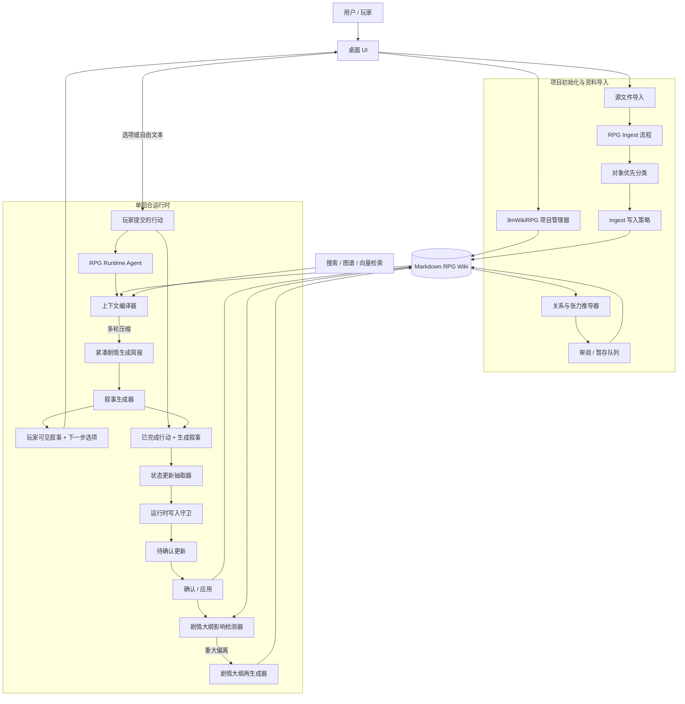

# llmWikiRPG 最终架构

## 最终目标

llmWikiRPG 的最终目标，不是把作品资料整理成普通百科，而是把作品资料、玩家状态、当前场景、关系张力、文风规则和回合日志组织成一个可读写的 RPG 运行时知识库。玩家可以与 llmWikiRPG 实时对话，并通过行动推动剧情。

当前产品已经硬切换为 RPG-only：

- 只支持 `llmwikirpg` 项目。
- `default` / legacy llm_wiki 项目不迁移、不兼容，直接拒绝打开。
- 新项目不创建旧目录。
- 应用不自动删除用户磁盘上的旧目录，但 UI、prompt、ingest、保存入口都不再展示或写入旧目录。
- `wiki/sources/` 保留，它是 RPG 证据层，不属于 legacy 模式。

最终产品应支持五个核心能力：

1. 创建 RPG 项目并导入作品资料后，系统能按 RPG runtime 目录抽取、分类、保存和更新条目。条目必须服务互动叙事，例如 `characters/` 不是百科人物页，而是可扮演、可互动、可约束生成的角色模型。
2. 导入完成后，系统可以基于已有条目推导隐式关系、张力、冲突、吸引、误解、依赖、压力点和剧情钩子，并写入专门的关系/张力层。
3. 用户可以手动放入不需要 ingest 的规则、文风、变量和运行指令，例如 `{{setvar::wenfeng::...}}`，这些内容作为高优先级运行时上下文参与叙事生成。
4. 用户端提供真正的 RPG runtime agent。它能读 wiki，也能在严格权限下写回动态条目，例如 `current-scene/`、`events/`、`player/`、`relationships/` 以及运行时角色状态，但不能改写稳定设定。
5. 每一回合系统都会生成剧情正文和下一步行动选项。玩家可选择选项，也可自由输入行动；系统根据行动推进剧情，并把确认后的状态变化写回 wiki。

## RPG-only 项目边界

llmWikiRPG 项目必须能被验证为 RPG 项目：

```json
{ "mode": "llmwikirpg" }
```

或在 `schema.md` 中包含：

```md
wikiMode: llmwikirpg
```

缺少 RPG 标记、标记为 `default`、或只包含旧 llm_wiki 目录结构的项目应被拒绝打开。拒绝是产品行为，不是错误恢复路径。

## Runtime Wiki 目录

新项目只应创建并使用以下目录：

```text
wiki/sources/
wiki/world/
wiki/characters/
wiki/characters/runtime/
wiki/player/
wiki/locations/
wiki/locations/runtime/
wiki/factions/
wiki/factions/runtime/
wiki/items/
wiki/items/runtime/
wiki/outlines/
wiki/plot-arcs/
wiki/events/
wiki/current-scene/
wiki/relationships/
wiki/style/
wiki/rules/
wiki/quests/
wiki/memory/
```

以下旧 llm_wiki 目录不再是产品能力：

```text
wiki/entities/
wiki/concepts/
wiki/queries/
wiki/comparisons/
wiki/synthesis/
wiki/methodology/
wiki/findings/
wiki/thesis/
```

如果已打开的 RPG 项目磁盘上存在旧目录，应用本阶段不自动删除用户文件；但 UI 不展示、不写入，ingest 也必须拒绝这些路径的 FILE block。

## 架构图



## 核心分层

### 1. 项目与 Wiki 层

Markdown 仍然是事实来源。项目必须包含 `.llm-wiki/project.json`、`schema.md`、`purpose.md`、`wiki/index.md`、`wiki/overview.md` 以及 RPG wiki 目录。

`.llm-wiki/` 是内部应用元数据目录，不代表 legacy 产品模式。

| 层级 | 作用 | 典型路径 | 可变性 |
|---|---|---|---|
| 来源证据层 | 原始资料摘要、来源追溯、证据边界 | `wiki/sources/` | ingest 更新 |
| 稳定设定层 | 世界观、规则、原作角色模型、固定地点/势力/物品 | `wiki/world/`、`wiki/characters/`、`wiki/locations/`、`wiki/factions/`、`wiki/items/` | ingest / 手动 |
| 推导解释层 | 从设定与事件中推导出的关系、张力、剧情压力 | `wiki/relationships/`、`wiki/plot-arcs/` | 推导 / 审阅 |
| 运行时状态层 | 当前回合状态、玩家状态、目标进度、已发生事件、当前场景 | `wiki/current-scene/`、`wiki/events/`、`wiki/player/`、`wiki/quests/`、runtime overlay | runtime agent |
| 控制层 | 文风、规则、变量、用户记忆、主线大纲、运行约束 | `wiki/style/`、`wiki/rules/`、`wiki/memory/`、`wiki/outlines/` | 仅手动或显式用户动作 |

对于混合目录，最终架构应避免在游玩过程中直接改写稳定来源页，而是使用运行时覆盖层：

```text
wiki/characters/tohsaka-rin.md
wiki/characters/runtime/tohsaka-rin.md

wiki/locations/church.md
wiki/locations/runtime/church.md
```

运行时上下文编译器先读取稳定页，再叠加运行时页。这样既保留原始设定资料，又提供会持续变化的战役状态。

### 2. Ingest 层

RPG ingest 的职责不是把静态资料整理成普通百科，而是把网络资料、原作设定、剧情梗概、人物台词和用户补充编译成可用于 RPG 运行时的短、准、高价值知识。

ingest 应被视为有损编译器。它不应问“这段资料里有什么设定值得保存”，而应问“这段资料里有什么能让下一回合更好玩、更沉浸、更一致、更有张力”。

未来 ingest 应分成三层：

| 层 | 作用 | 典型输出 |
|---|---|---|
| 来源证据层 | 记录资料来源、摘要、可信度、冲突和证据边界 | `wiki/sources/` |
| RP 信号层 | 从大文本中筛出能影响扮演、行动、张力、状态和文风的高价值信号 | 中间结构 / review |
| 运行条目层 | 生成短、准、可用于回合上下文的 RPG 页面 | `characters/`、`locations/`、`relationships/` 等 |

核心规则：

- 分类必须对象优先，但不能止步于对象分类：先判断片段是角色模型、关系线索、事件、世界事实、地点、势力、物品、文风笔记、规则、任务线索还是噪声，再判断它对 RPG 运行是否有用。
- 所有来源片段都要通过 RP utility gate：它是否改变 NPC 表演、玩家行动、关系张力、场景钩子、剧情压力、状态后果、文风规则或硬设定边界。
- 低价值百科信息、粉丝标签、版本信息、长篇路线流水、声优 / 制作 trivia、无行动价值的背景解释，不应进入 runtime-facing 页面；最多进入 `sources/`、review，或作为噪声丢弃。
- 非 `sources/` 页面应逐步包含 `Runtime Capsule`，作为运行时上下文编译器优先读取的短入口，而不是默认让 runtime 读取整页。
- 生成页面必须可用于 RPG：角色页应是 NPC 操作模型，地点页应像场景卡，势力页应像压力源，物品页应强调用法 / 代价 / 风险，关系页应强调信任、张力和变化触发器。
- 长来源应先分块抽取 RP 信号，再全局去重、合并、评分、排序，最后只用高价值信号生成目标页面；不应把 chunk 摘要直接拼成百科页。
- 页面应有软长度预算。超过预算时应触发 review、压缩或 post-ingest distiller，而不是静默增长。
- 写入必须遵守策略：静态资料可创建或合并稳定设定、来源证据和可审阅推导笔记；除非输入明确标记为实时运行输入，否则不能更新 live 的 `current-scene/`。
- ingest 必须拒绝 legacy 目录 FILE block，不允许把不确定内容回退写入旧 `entities/`、`concepts/` 或 `queries/`。

RP 信号可以用以下语义评分：

| 分数 | 含义 | 处理 |
|---|---|---|
| 0 | 噪声，和 RPG 运行无关 | 丢弃 |
| 1 | 仅有出处价值 | 只进入 `sources/` |
| 2 | 弱信号或不确定信号 | 进入证据 / 待确认 / review |
| 3 | 可用页面内容 | 可进入目标页正文 |
| 4 | 强运行时信号 | 应进入 `Runtime Capsule` |
| 5 | 关键硬约束或高价值扮演规则 | 高优先级进入 capsule、`rules/`、`style/` 或角色操作规则 |

`Runtime Capsule` 是 ingest 与 runtime 的关键契约。推荐结构：

```md
## Runtime Capsule

- 一句话定位：
- 对玩家行动的意义：
- 关键约束：
- 可触发钩子 / 压力点：
- 扮演 / 氛围提示：
- 不要误写成：
```

不同目录的运行时目标：

| 目录 | 避免 | 应该抽取 |
|---|---|---|
| `world/` | 大段世界观百科 | 行动限制、社会规则、常识、禁忌、风险、氛围 |
| `locations/` | 地点介绍 | 场景卡：感官锚点、入口、危险、线索、可交互物、常见在场角色 |
| `factions/` | 组织百科 | 势力压力源：目标、资源、反应阈值、杠杆、玩家触发后果 |
| `items/` | 道具设定罗列 | 用法、代价、限制、持有者、风险、线索价值、剧情功能 |
| `events/` | 原作路线复述 | 已确认发生的事件、造成的状态变化、谁知道、留下什么后果 |
| `outlines/` | 运行时事实或状态流水 | 作者/GM 侧主线大纲、章节安排、揭示顺序、分支条件、不能提前揭露的内容 |
| `plot-arcs/` | 原作剧情总览或完整大纲 | 未解决问题、冲突压力、推进条件、当前阶段、可能发展 |
| `relationships/` | 人物关系介绍 | 信任、张力、依赖、误解、秘密、升级 / 降级触发器 |
| `characters/` | 人物传记 | NPC 操作模型：欲望、恐惧、触发点、行为边界、对白规则、RP 用法 |
| `style/` | 原文摘录 | 可执行文风规则、对白节奏、禁用写法、叙事基调 |
| `rules/` | 世界解释散文 | 硬规则、代价、成功 / 失败边界、平衡约束 |

不同来源类型的主要输出：

| 来源类型 | 主要输出 |
|---|---|
| 设定资料 | `sources/` 证据摘要；高价值世界约束进入 `world/` / `rules/`；可行动地点、势力、物品进入对应目录 |
| 角色分析 / 人物百科 | `characters/` 的操作模型、行为边界、对白风格、受压反应；低价值传记留在 `sources/` |
| 原始剧情概要 | 离散已发生后果进入 `events/`；长跨度冲突、未解压力和推进条件进入 `plot-arcs/` |
| 主线大纲 / 未来剧情指导 | `outlines/`，通过 control doc import 保真规范化，不作为普通 source ingest |
| 对白语料 | `characters/*` 的对白节奏、称呼习惯、回避方式、互动模式；关系张力信号进入 `relationships/` 或 derivation review |
| 用户风格 / 规则笔记 | `style/`、`rules/`、`memory/`，除非用户明确要求，否则不当作普通静态资料 ingest |
| 实时游玩日志 | 仅运行时更新路径，不作为静态正典 ingest；已确认事实由 runtime update / review 写入动态层 |

后续应增加 ingest quality lint 和 post-ingest distiller：前者发现超长页面、缺少 `Runtime Capsule`、缺少行动性、路线复述漂移和低价值百科信息；后者把已有长页面压缩成可审阅的 runtime-facing 提案。

### 3. 关系与张力推导层

关系/张力推导是独立子系统，不应隐藏在普通 ingest 中。

导入后，推导任务读取当前 wiki，并生成对 RPG 有用的隐含材料：

- 关系状态：信任、依赖、吸引、竞争、义务、恐惧、愧疚、控制、保密。
- 张力点：什么会破裂，什么会升级，什么不能过快解决。
- 互动杠杆：玩家的哪些行动会对角色或势力施压。
- 戏剧约束：在浪漫、背叛、告白、战斗、结盟或揭秘变得合理之前，需要先铺垫什么。
- 潜在线索：未解之谜、矛盾、承诺、威胁、情感债务、信息不对称。

推导内容必须显式标注为解释性内容：

```yaml
---
type: relationship
source_kind: derived
derived_from:
  - wiki/characters/example.md
  - wiki/events/example-event.md
confidence: medium
canon_status: inferred_for_play
---
```

默认情况下，推导层应以审阅 / 暂存模式运行。它的职责是把隐含内容显式化，因此人工确认很重要。

### 4. 手动上下文层

有些内容不应走普通 ingest，例如文风规则、写作口吻、系统约束、桌规、自定义变量、节奏偏好和战役专用指令。

推荐路径：

```text
wiki/style/wenfeng.md
wiki/rules/table-rules.md
wiki/memory/manual-notes.md
```

示例：

```md
# 写作风格

{{setvar::wenfeng::
- 以冷峻的宿命感与理性的现实主义为基调。
- 让神话般的宏大魔术与现代战术的残酷杀伐交织。
}}
```

运行时上下文编译器应能解析或保留这些块，并把它们作为高优先级指令注入叙事提示词中。它们属于用户手写控制文件，ingest 和运行时状态抽取都不应自动改写。

### 5. RPG Runtime Agent

最终 runtime agent 应与 wiki QA 聊天路径分离。它是带状态的游戏循环，并拥有受控 wiki 写权限。

单回合流程：

1. 接收玩家行动，可以是选项，也可以是自由输入。
2. 在把下一回合视为“就绪”之前，先完成上一玩家行动以及由它生成的叙事回写。展示给玩家的下一步选项只是可能性，不是已经发生的事件。
3. 编译必要上下文：当前场景、玩家状态、目标/任务进度、最近事件、活动剧情弧、相关关系/张力、相关角色/地点/势力/物品、文风/规则/手动上下文。
4. 执行多轮上下文压缩，形成紧凑剧情生成简报。
5. 将简报、玩家行动和高优先级规则发送给叙事生成器。
6. 生成玩家可见剧情。
7. 生成 3 到 5 个下一步行动选项。未选择的选项不得写入 wiki。
8. 从“已完成行动 + 叙事”中抽取候选状态变更。
9. 通过运行时写入策略验证候选写入。
10. 将更新暂存等待确认，或在项目设置允许时自动应用。
11. 把被接受的更新写回动态 wiki 路径。
12. 检测本回合是否对既有剧情大纲造成实质偏离；如有，则基于已发生事件、角色冲突、关系张力和当前状态修订未来大纲。

runtime agent 只能通过专用更新 API 写入，不能自由调用通用文件写入。

运行时写入策略：

| 路径 | 运行时写入策略 | 规则 |
|---|---|---|
| `wiki/current-scene/scene_state.md` | 覆盖 | 只保存最新即时场景 |
| `wiki/events/` | 追加 / 创建 | 只记录确认发生的事件 |
| `wiki/player/` | 合并 | 玩家状态、物品栏、知识、目标 |
| `wiki/quests/` | 合并 | 目标、任务、阻碍、完成状态和已接受的运行时目标变化 |
| `wiki/relationships/` | 合并 | 关系状态和张力变化 |
| `wiki/plot-arcs/` | 合并 | 未解问题、冲突压力、可能发展 |
| `wiki/characters/runtime/` | 合并 | NPC 的当前战役状态覆盖层 |
| `wiki/locations/runtime/` | 合并 | 当前地点状态覆盖层 |
| `wiki/factions/runtime/` | 合并 | 当前势力立场 / 资源覆盖层 |
| `wiki/items/runtime/` | 合并 | 当前持有者、状态、消耗情况 |
| `wiki/world/`、`wiki/rules/`、`wiki/style/`、`wiki/sources/`、`wiki/memory/`、`wiki/outlines/`、base `wiki/characters/*.md` / `wiki/locations/*.md` / `wiki/factions/*.md` / `wiki/items/*.md` | 阻止 | 运行时不改写稳定、证据、控制、手动或 base 材料 |

关键区别：runtime 可以改变这场游戏中的世界状态，但不能改写原始世界观。

### 6. 行动选项生成

每次 RPG 回复都应同时包含叙事正文和可执行选项。选项本身是节奏和状态控制的一部分。

```ts
interface RpgActionOption {
  id: string
  label: string
  playerFacingText: string
  intent: "investigate" | "talk" | "fight" | "move" | "wait" | "use_item" | "custom"
  riskLevel: "low" | "medium" | "high"
  likelyAffectedPaths: string[]
}
```

可见 UI 可以只展示 `playerFacingText`，而 `likelyAffectedPaths` 帮助 runtime 编译器在选项被选中后补入正确上下文。自由输入的玩家行动在生成前也应被分类为相同的 intent 结构。

未被选择的选项不是正史。它们可以保留在 UI 状态或运行时回合记录里用于调试，但不能合并进 wiki 状态、事件历史、当前场景、关系状态或剧情大纲。

## 相对当前代码的主要方向变化

当前代码库已经具备：

- RPG-only 项目模式和打开校验。
- RPG 启动目录和后端直接创建 RPG skeleton。
- RPG 分类、schema、prompt、写入策略和动态校验。
- 最终 schema overlay 契约已经落到前后端 bootstrap、category/schema 文案和测试：`characters`、`locations`、`factions`、`items` 的 base 页承载稳定设定，`runtime/` 子目录承载游玩中变化。
- 运行时基础链路已经建立：Runtime Agent / Context Compiler、Turn Model、Narration Interaction、Runtime Update Interaction、Pending Updates、Runtime Write Policy、RPG Play Panel 与 Pending Review / Apply UI。
- Stage 6.12 已把 `wiki/quests/` 明确为 objective tracking / runtime merge 目录，并对齐 bootstrap、reference allowlist、context compiler、runtime update target policy、write policy、UI type/display 和文档契约。
- 旧 default prompt/template 分支已移除。
- ingest 写入边界会拒绝 legacy 目录。
- `Save to Memory` 写入 `wiki/memory/`。
- 基础 RPG UI 类型、图谱、知识树和检索优先级。

要达到最终架构，还需要：

1. 建立 runtime persistence：持久化 `RpgTurnRecord`、pending updates、accept/reject/apply 结果和审计日志，避免刷新或重开项目后丢失运行时审阅状态。
2. 增强 apply 后可靠性：应用 accepted updates 后刷新 current-scene、文件树和相关 UI 状态，让玩家看到的运行态与已写入 wiki 保持一致。
3. 增强 runtime update 语义校验和 merge 语义：在 pending 前阻止 future plan 写入 `events`、候选选项污染事实、current-scene 长期设定污染，并把 append-style merge 升级为 section-aware merge。
4. 升级 Context Compiler v1：利用 selected option、`likelyAffectedPaths`、recent accepted events、runtime overlays、relationships、plot-arcs 和 objective/quest 信息做更准确的上下文预算。
5. 将关系/张力推导做成独立后置任务，默认进入 review/pending，避免把推测伪装成原作事实。
6. 在 runtime 状态更稳定后增加剧情大纲影响检测器和大纲再生成器；大纲再生成应生成可审阅提案，而不是自动覆盖未来剧情。
7. 增加整项目审计 / 评估工具，检查错误路由、状态污染、未选选项污染、运行时越权写入、角色卡结构漂移和真实模型长回合稳定性。

## 建议的最终模块边界

```text
src/lib/rpg-runtime/
  context-compiler.ts
  context-compressor.ts
  narration-prompts.ts
  action-options.ts
  state-extractor.ts
  update-validation.ts
  write-policy.ts
  update-staging.ts
  runtime-journal.ts
  merge-policy.ts
  overlay-resolver.ts
  outline-impact.ts
  outline-regenerator.ts

src/lib/rpg-derivation/
  relationship-deriver.ts
  tension-deriver.ts
  derivation-prompts.ts
  derivation-review.ts

src/components/rpg/
  rpg-play-panel.tsx
  current-scene-panel.tsx
  action-options-panel.tsx
  pending-updates-panel.tsx
  turn-history-panel.tsx
  outline-impact-panel.tsx
```

现有 ingest、搜索、图谱相关性、上下文预算、LLM 客户端、文件系统命令和 project-mode 模块应继续作为共享基础设施存在。

## 验收形态

当以下产品行为可以实现时，这套架构就算完成：

- 用户创建一个 `llmwikirpg` 项目并导入多个文件。
- wiki 中填充的是适合 RPG 使用的条目，而不是普通百科式长文堆积。
- 新项目和打开项目都不接受 legacy/default 模式。
- 旧目录不会被 UI 展示、不会被 prompt 要求、不会被 ingest 写入。
- 用户运行一次关系/张力推导流程，并收到可审阅的推导页。
- 用户在 `wiki/style/` 下放入手动风格文件，运行时叙事能持续遵循它。
- 用户从 `current-scene` 开始游戏。
- 每一回合都产生叙事和下一步行动选项。
- 选择或输入一个行动后，场景会推进。
- runtime agent 只更新被允许的动态文件。
- `quests` 作为 objective tracking 目录参与运行时上下文，并只允许 accepted runtime merge 更新目标、阻碍和完成状态。
- 未被选择的下一步行动不会作为“已发生事件”、场景状态、关系变化或剧情弧事实写入。
- 当玩家行动强烈改变战役方向时，系统能检测到大纲影响，并基于现有正典、冲突、关系张力和已接受玩法状态修订未来剧情大纲。
- 原始设定文件和来源支撑的角色模型保持不变。
- `events` 记录“发生了什么”，`outlines` 记录作者/GM 侧未来安排，`plot-arcs` 记录未解/运行时剧情压力，`current-scene` 始终只保存最新快照。

## 非目标

当前最终架构不要求立刻用数据库替换 Markdown，也不要求先构建多智能体编排系统。

本项目按全新 `llmWikiRPG` 设计，后续方案和实现默认不为旧项目迁移、旧目录兼容或 legacy fallback 付出设计成本。legacy `default` 模式和旧 llm_wiki 目录已经不是产品能力；后续工作应基于 RPG-only 前提继续推进。
