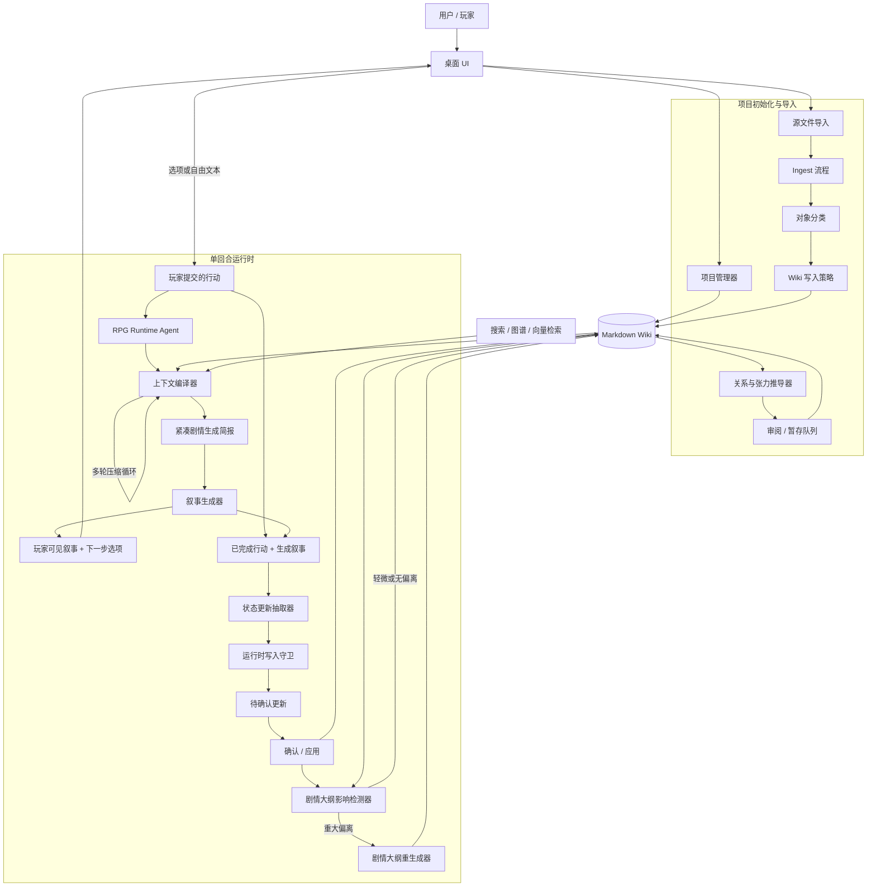

# llmWikiRPG 最终架构

## 最终目标

llmWikiRPG 的最终目标，不是把作品资料整理成百科，而是把作品资料、玩家状态、当前场景、关系张力、文风规则和回合日志组织成一个可读写的 RPG 运行时知识库。

最终产品应支持五个核心能力：

1. 在创建新项目并导入作品资料后，系统能自动分类、抽取并写入 RPG wiki 条目。条目必须服务于互动叙事，例如 `characters/` 不是百科人物页，而是可扮演、可互动、可约束生成的角色模型。
2. 在导入完成后，系统可以基于已有条目推导隐式关系、张力、冲突、吸引、误解、依赖、压力点和剧情钩子，并写入专门的关系/张力层。
3. 用户可以手动放入不需要 ingest 的规则、文风、变量和运行指令，例如 `{{setvar::wenfeng::...}}`，这些内容作为高优先级运行时上下文参与叙事生成。
4. 用户端提供一个真正的 RPG runtime agent。它能读写 wiki，也能在严格权限下写回动态条目，例如 `current-scene/`、`events/`、`player/`、`relationships/` 以及运行时角色状态，但不能改写稳定设定。
5. 每一回合系统都会生成剧情正文和下一步行动选项。玩家可选择选项，也可自由输入行动；系统根据行动推进剧情，并把确认后的状态变化写回 wiki。

## 架构图



## 核心分层

### 1. 项目与 Wiki 层

Markdown 仍然是事实来源。应用应继续创建本地项目，并包含 `.llm-wiki/project.json`、`schema.md`、`purpose.md`、`wiki/index.md`、`wiki/overview.md` 以及 RPG wiki 目录。

最终 wiki 应被视为分层数据，而不只是文件夹集合：

| 层级 | 作用 | 典型路径 | 可变性 |
|---|---|---|---|
| 来源证据层 | 原始文件摘要与来源溯源 | `wiki/sources/` | 仅 ingest |
| 稳定正典层 | 世界观、规则、原始角色模型、固定地点 | `wiki/world/`、`wiki/rules/`、`wiki/style/`、`wiki/characters/`、`wiki/locations/`、`wiki/factions/`、`wiki/items/` 的基础页 | 仅 ingest / 手动 |
| 推导解释层 | 从正典中推导出的关系、张力、剧情压力 | `wiki/relationships/`、`wiki/plot-arcs/`、可选的 `wiki/tensions/` 或 `relationships/*` 子区块 | 推导 / 审阅 |
| 运行时状态层 | 玩家推进和生成叙事造成的当前回合状态 | `wiki/current-scene/`、`wiki/events/`、`wiki/player/`，以及角色/地点/势力/物品目录下的运行时覆盖层 | runtime agent |
| 手动控制层 | 用户手写变量、文风、表规则、安全和战役约束 | `wiki/style/`、`wiki/rules/`、`wiki/memory/` | 仅手动 |

现有的 11 个目标目录应继续有效。对于 `characters` 这类混合目录，最终架构应避免在游玩过程中直接修改原始来源页，而是使用运行时覆盖层：

```text
wiki/characters/tohsaka-rin.md              # 来自来源的角色模型，不因游玩而改变
wiki/characters/runtime/tohsaka-rin.md      # 本战役的当前状态覆盖层

wiki/locations/church.md                    # 稳定地点事实
wiki/locations/runtime/church.md            # 当前损伤、占用、线索、可进入状态
```

运行时上下文编译器先读取稳定页，再叠加运行时页。这样既能保留原始设定资料，又能提供一个会持续变化的战役状态。

### 2. Ingest 层

当前项目已经具备大体正确的结构：源文件导入会经过分析、生成、文件块解析、验证和 wiki 写入。最终版本应在三个方向上加强：

- 分类必须以对象为中心：在选择文件夹之前，先识别一个源片段到底是角色模型、关系线索、对白语料、事件、世界事实、地点、势力、物品、文风笔记还是噪声。
- 生成出来的页面必须可用于 RPG：角色页不应只是简介，而应包含行为规则、对白风格、受压反应、边界、关系动态、场景钩子、证据和不确定性。
- 导入写入必须遵守写入策略：静态来源导入可以创建或合并稳定正典与推导笔记，但除非输入明确标记为实时运行时输入，否则不能更新 live 的 `current-scene/`。

不同来源类型应区别对待：

| 来源类型 | 主要输出 |
|---|---|
| 百科式设定 | `world/`、`locations/`、`factions/`、`items/`、`sources/` |
| 角色分析 | `characters/`、`relationships/`、`plot-arcs/` |
| 原始剧情概要 | 离散 `events/`、长跨度 `plot-arcs/`、受影响的角色状态笔记 |
| 对白语料 | `characters/*` 的对白风格、关系动态、张力提示 |
| 用户风格 / 规则笔记 | `style/`、`rules/`、`memory/`，除非明确要求，否则不作为普通 ingest |
| 实时游玩日志 | 仅运行时更新路径，不作为静态正典 ingest |

### 3. 关系与张力推导层

这是一个新的重要子系统，不应被隐藏在普通 ingest 之中。

导入之后，推导任务会读取当前 wiki，并生成源文本中可能缺失、但对 RPG 有用的隐含材料：

- 关系状态：信任、依赖、吸引、竞争、义务、恐惧、愧疚、控制、保密；
- 张力点：什么会破裂，什么会升级，什么不能过快解决；
- 互动杠杆：玩家的哪些行动会对每个角色或势力施压；
- 戏剧约束：在浪漫、背叛、告白、战斗、结盟或揭示变得合理之前，需要先铺垫什么；
- 潜在线索：未解之谜、矛盾、承诺、威胁、情感债务、信息不对称。

推导内容必须清晰标注为解释性内容：

```yaml
---
type: relationship
source_kind: derived
derived_from:
  - wiki/characters/example.md
  - wiki/events/example-event.md
confidence: medium
canon_status: inferred_for_play
---
```

这一层应优先写入 `wiki/relationships/` 和 `wiki/plot-arcs/`。如果以后新增专门的 `wiki/tensions/` 目录，它也应只是一个推导索引，而不是 `relationships` 的替代品。

默认情况下，推导层应以审阅 / 暂存模式运行。因为这个子系统的职责就是把隐含内容显式化，所以人工确认很重要。

### 4. 手动上下文层

有些内容不应走 ingest 流程。例如文风规则、写作口吻、系统约束、表规则、自定义变量、节奏偏好和战役专用指令。

推荐路径：

```text
wiki/style/wenfeng.md
wiki/rules/table-rules.md
wiki/memory/manual-notes.md
```

示例内容：

```md
# 写作文风

{{setvar::wenfeng::
## 写作文风
- 模仿《FateZero》的文风。
- 以冷峻的宿命感与理性的现实主义为基调。
- 将神话般的宏大魔术交锋与现代战术的残酷杀戮无缝交织。}}
```

运行时上下文编译器应能解析或保留这些块，并把它们作为高优先级指令注入叙事提示词中。它们属于人工编写的控制文件，因此无论是 ingest 还是运行时状态抽取，都不应自动改写它们。

### 5. RPG Runtime Agent

最终的 runtime agent 应与当前的 wiki QA 聊天路径分离。它应该是一个带状态的游戏循环，并且拥有受控的 wiki 写权限。

单回合流程：

1. 接收玩家行动，可以是选项，也可以是自由输入。
2. 在把下一回合视为“就绪”之前，先完成上一玩家行动以及由它生成的叙事的回写。展示给玩家的下一步选项不属于这次回写，因为它们只是可能性，不是已经发生的事件。
3. 编译必需上下文：
   - 当前场景；
   - 玩家状态；
   - 最近事件；
   - 活动中的剧情弧；
   - 相关关系 / 张力页；
   - 当前角色正典页及运行时覆盖层；
   - 相关地点 / 势力 / 物品页；
   - 文风 / 规则 / 手动上下文。
4. 执行多轮上下文压缩。上下文编译器应把检索到的 wiki 材料迭代压缩成一个紧凑的剧情生成简报：当前事实、硬约束、活动张力、相关角色行为规则、场景压力以及禁止出现的矛盾。
5. 只把紧凑剧情生成简报、玩家行动，以及必要的高优先级文风 / 规则指令发送给叙事生成器。
6. 生成玩家可见的剧情续写。
7. 生成 3 到 5 个下一步行动选项。这些选项只服务于下一次玩家输入；它们不得作为已经发生的事件写入 `events/`、`current-scene/`、`plot-arcs/` 或任何其他 wiki 页面。
8. 从“已完成行动 + 叙事”中抽取候选状态变更。
9. 通过运行时写入策略验证候选写入。
10. 将更新暂存等待确认，或在项目设置允许时自动应用。
11. 把被接受的更新写回动态 wiki 路径。
12. 检测这次被接受的回合是否对既有剧情大纲造成了实质偏离。如果有，则使用现有大纲、角色冲突、关系 / 张力页、已发生事件和当前场景状态，重新生成或修订受影响的剧情大纲。

runtime agent 只能通过专用更新 API 写入，不能自由调用通用的 `writeFile()`。

运行时回写的基本单位是 `(玩家行动, 生成叙事)` 这一对。候选下一步行动不属于这个单位。这个规则可以防止 wiki 被未选择的可能性污染。

运行时写入策略：

| 路径 | 运行时写入策略 | 规则 |
|---|---|---|
| `wiki/current-scene/scene_state.md` | 覆盖写入 | 仅保存最新即时场景 |
| `wiki/events/` | 追加 / 创建 | 仅记录确认发生的事件 |
| `wiki/player/` | 合并 | 玩家状态、物品栏、知识、目标 |
| `wiki/relationships/` | 合并 | 关系状态和张力变化 |
| `wiki/plot-arcs/` | 合并 | 未解问题、冲突压力、可能发展 |
| `wiki/characters/runtime/` | 合并 | NPC 的当前战役状态覆盖层 |
| `wiki/locations/runtime/` | 合并 | 当前地点状态覆盖层 |
| `wiki/factions/runtime/` | 合并 | 当前势力立场 / 资源覆盖层 |
| `wiki/items/runtime/` | 合并 | 当前持有者、状态、消耗情况 |
| `wiki/world/`、`wiki/rules/`、`wiki/style/`、基础 `wiki/characters/*.md` | 阻止 | 运行时不能改变稳定材料 |

关键区别在于：runtime 可以改变这场游玩中的世界，而不能改写原始世界观。

剧情大纲重生成应该尽量保守。只有当某一回合改变了前提、阵营、存活状态、地点可达性、已揭示秘密、关系状态或冲突压力，且这种变化足以让既有大纲把故事拉回过时路径时，才应触发重生成。重生成后的大纲必须保留已经发生的事件，并把新轨迹解释为对已接受玩法状态的响应，而不是任意改写。

### 6. 行动选项生成

每次 RPG 回复都应该同时包含叙事正文和可执行选项。选项不只是 UI 装饰，它们本身就是节奏和状态控制的一部分。

每个生成的选项都应携带隐藏或结构化元数据：

```ts
interface RpgActionOption {
  id: string
  label: string
  playerFacingText: string
  intent: "investigate" | "talk" | "fight" | "move" | "wait" | "use_item" | "custom"
  riskLevel: "low" | "medium" | "high"
  likelyAffectedPaths: string[]
}
```

可见 UI 可以只展示 `playerFacingText`，而 `likelyAffectedPaths` 则帮助 runtime 编译器在选项被选中后补入正确上下文。自由输入的玩家行动在生成前也应被分类为相同的 intent 结构。

未被选择的选项不是正史。它们可以保留在 UI 状态或运行时回合记录里用于调试，但不能合并进 wiki 状态、事件历史、当前场景、关系状态或剧情大纲。

## 相对当前代码的主要方向变化

当前代码库已经具备：

- `llmwikirpg` 项目模式和 RPG 启动目录；
- RPG 分类注册表和 schema 配置；
- 两阶段 RPG ingest 提示词流程；
- `current-scene` 和 `events` 的 RPG 动态写入校验；
- 现有聊天面板中的基础 RPG 检索优先级。

要达到最终架构，还需要以下方向性改造：

1. 将 `ChatPanel` 拆分为两个体验：wiki QA 聊天和 RPG 游戏运行时。当前聊天路径可以继续用于询问 wiki，但 RPG 游玩应使用专门的 runtime 控制器和 prompt builder。
2. 引入运行时上下文编译器。它应在搜索结果之前确定性地组装必需上下文，理解正典页和运行时覆盖层，并通过多轮压缩把检索材料收敛成紧凑的剧情生成简报。
3. 引入写入策略层。运行时写入必须经过按类别区分的权限和策略，而不能只是通用文件写入。
4. 为混合类别添加运行时覆盖层。角色、地点、势力和物品都需要“来源正典基础页 + 可变战役状态覆盖层”。
5. 把关系 / 张力推导做成单独的后置任务，并带审阅 / 暂存和显式的 `source_kind: derived` 溯源信息。
6. 增加对 `style/`、`rules/`、`memory/` 以及 `{{setvar::...}}` 块的手动上下文解析和优先级规则。
7. 增加回合模型和行动选项模型。仅靠聊天消息不足以表达玩家行动、生成叙事、未选选项、待处理更新、已接受状态变化和大纲影响判断。
8. 增加大纲影响检测器和大纲重生成器。由玩家造成的重大偏离，应该基于已有事件、角色冲突、关系张力和当前状态来修正未来剧情压力，而不是强行把故事拉回过时大纲。
9. 为当前场景、行动选项、待处理更新、大纲变化提示和受影响 wiki 页面增加 UI 区域。
10. 增加整项目审计 / 评估工具。最终质量取决于能否识别错误路由、缺失的关系 / 张力页、对不可变页面的运行时写入、选项泄漏进 wiki 状态，以及角色卡结构漂移。

## 建议的最终模块边界

最终实现应收敛到以下一组一等模块：

```text
src/lib/rpg-runtime/
  context-compiler.ts
  context-compressor.ts
  narration-prompts.ts
  action-options.ts
  state-extractor.ts
  write-policy.ts
  update-staging.ts
  overlay-resolver.ts
  outline-impact.ts
  outline-regenerator.ts

src/lib/rpg-derivation/
  relationship-deriver.ts
  tension-deriver.ts
  derivation-prompts.ts
  derivation-review.ts

src/components/rpg/
  rpg-play-panel.tsx
  current-scene-panel.tsx
  action-options-panel.tsx
  pending-updates-panel.tsx
  outline-impact-panel.tsx
```

现有的 ingest、搜索、图谱相关性、上下文预算、LLM 客户端、文件系统命令和 project-mode 模块，都应继续作为共享基础设施存在。

## 验收形态

当以下产品行为可以实现时，这套架构就算完成：

- 用户创建一个 `llmwikirpg` 项目并导入多个文件。
- wiki 中填充的是适合 RPG 使用的条目，而不是百科式长文堆积。
- 用户运行一次关系 / 张力推导流程，并收到可审阅的推导页。
- 用户在 `wiki/style/` 下放入一个手动风格文件，运行时叙事能够持续遵循它。
- 用户从 `current-scene` 开始游戏。
- 每一回合都会产生叙事和下一步行动选项。
- 选择或输入一个行动后，场景会推进。
- runtime agent 只更新被允许的动态文件。
- 未被选择的下一步行动不会作为“已发生事件”、场景状态、关系变化或剧情弧事实写入。
- 当玩家行动强烈改变战役方向时，系统能检测到大纲影响，并基于现有正典、冲突、关系张力和已接受的玩法状态修订未来剧情大纲。
- 原始设定文件和来源支撑的角色模型保持不变。
- 事件记录“发生了什么”，剧情弧记录未解 / 未来压力，而 `current-scene` 始终只保存最新快照。

## 非目标

这份最终架构并不要求立刻用数据库替换 Markdown，不要求删除 legacy default mode，不要求删除 `entities` 或 `concepts`，也不要求先构建多智能体编排系统。这些能力以后可能会有价值，但当前核心产品赌注应保持简单：一个本地 Markdown RPG wiki，加上一个能够编译上下文、讲述剧情、提供行动并受控回写状态的 agent。
